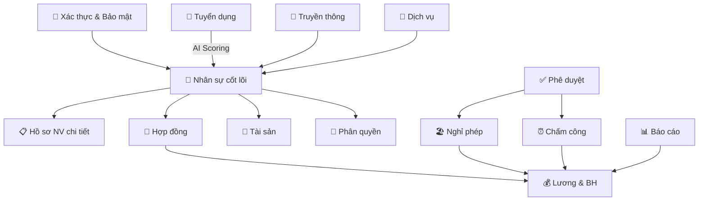

# Phân Tích Nghiệp Vụ - Hệ Thống HRM (Human Resource Management)

> **Công nghệ**: Laravel (PHP) + PostgreSQL + Redis + Docker
> **Kiến trúc**: REST API (không có giao diện frontend trong codebase)
> **Pattern**: Generic Resource Controller — dùng 1 controller duy nhất xử lý CRUD cho tất cả resource

---

## Tổng Quan Kiến Trúc

Hệ thống sử dụng một **Generic Resource Controller** pattern đặc biệt: thay vì mỗi module có controller riêng, toàn bộ CRUD được xử lý qua [GenericResourceController.php](file:///Users/vhozang/Doan2/app/Http/Controllers/Api/GenericResourceController.php), ánh xạ resource name sang tên bảng qua [HrmTables.php](file:///Users/vhozang/Doan2/app/Support/HrmTables.php). Hệ thống quản lý **81+ bảng** cơ sở dữ liệu, được migrate từ hệ thống MySQL cũ sang PostgreSQL.

---

## 1. 🔐 Xác Thực & Bảo Mật (Authentication & Security)

**Files chính**: [AuthController.php](file:///Users/vhozang/Doan2/app/Http/Controllers/Api/AuthController.php), [HrmAuth.php](file:///Users/vhozang/Doan2/app/Http/Middleware/HrmAuth.php)

| Nghiệp vụ | API Endpoint | Mô tả |
|---|---|---|
| Đăng nhập | `POST /auth/login` | Xác thực bằng email công ty + mật khẩu, trả về Bearer token |
| Xem thông tin cá nhân | `GET /auth/me` | Trả về thông tin nhân viên đang đăng nhập |
| Làm mới token | `POST /auth/refresh` | Cấp lại access token mới |
| Quên mật khẩu | `POST /auth/forgot-password` | Tạo yêu cầu reset password qua email |
| Đặt lại mật khẩu | `POST /auth/reset-password` | Dùng token để đặt lại mật khẩu mới |
| Xem phân cấp tổ chức | `GET /auth/hierarchy` | Trả về context phân cấp quản lý |

**Bảng liên quan**: `employees`, `api_tokens`, `password_reset_requests`

> [!NOTE]
> Token được lưu dạng hash SHA-256 trong bảng `api_tokens`, có thời hạn hết hạn (mặc định 3600 giây). Middleware `HrmAuth` kiểm tra token hợp lệ trước mỗi request cần xác thực.

---

## 2. 👥 Quản Lý Nhân Sự Cốt Lõi (Core HR)

**Bảng chính**: `employees`, `departments`, `positions`, `nationalities`, `banks`

| Nghiệp vụ | Mô tả |
|---|---|
| Quản lý nhân viên | CRUD thông tin nhân viên: mã NV, họ tên, ngày sinh, giới tính, SĐT, email cá nhân/công ty, trạng thái, ngày vào |
| Hồ sơ nhân viên mở rộng | Cập nhật/xem profile (JSONB), lịch sử công tác, chứng chỉ |
| Quản lý phòng ban | Danh mục phòng ban (mã, tên) |
| Quản lý chức vụ | Danh mục vị trí (mã, tên, nhóm, cấp bậc) |
| Quản lý quốc tịch | Danh mục quốc tịch |
| Quản lý ngân hàng | Danh mục ngân hàng (mã, tên, SWIFT code) |

**API đặc biệt**:
- `PATCH /employees/{id}/profile` — Cập nhật hồ sơ cá nhân
- `GET /employees/{id}/profile` — Xem hồ sơ cá nhân
- `GET /employees/{id}/employment-histories` — Xem lịch sử công tác
- `GET /employees/{id}/certificates` — Xem chứng chỉ
- `POST /employees/{id}/certificates` — Thêm chứng chỉ
- `DELETE /employees/{id}/certificates/{childId}` — Xóa chứng chỉ
- `POST /employees/import-probation` — Import nhân viên thử việc

---

## 3. 📝 Quản Lý Hồ Sơ Nhân Viên Chi Tiết

**Bảng liên quan**: `qualifications`, `qualification_types`, `certificates`, `certificate_types`, `identity_documents`, `document_types`, `social_insurance_info`, `dependents`, `employment_histories`

| Nghiệp vụ | Mô tả |
|---|---|
| Bằng cấp / Trình độ | Quản lý văn bằng: loại bằng, chuyên ngành, trường, năm tốt nghiệp, xếp loại, bằng cao nhất |
| Chứng chỉ | Quản lý chứng chỉ: loại, nơi cấp, ngày cấp/hết hạn, điểm, file đính kèm |
| Giấy tờ tùy thân | CMND/CCCD/Hộ chiếu: số, ngày cấp, nơi cấp, hạn, ảnh mặt trước/sau, có chip |
| Bảo hiểm xã hội | Số BHXH, BHYT, mã số thuế, nơi cấp, trạng thái |
| Người phụ thuộc | Quản lý người phụ thuộc cho giảm trừ thuế: quan hệ, tỷ lệ giảm trừ, thời hạn |
| Lịch sử công tác | Phòng ban, chức vụ, quyết định, thời gian — có cờ `is_current` |

---

## 4. 📄 Quản Lý Hợp Đồng (Contract Management)

**Bảng liên quan**: `contract_types`, `contract_templates`, `contracts`, `contract_histories`, `contract_change_logs`

| Nghiệp vụ | Mô tả |
|---|---|
| Loại hợp đồng | Danh mục loại HĐ (mã, tên, mô tả, trạng thái) |
| Mẫu hợp đồng | Template HĐ: nội dung, phiên bản, file đính kèm, ngày hiệu lực |
| Hợp đồng | Quản lý HĐ nhân viên: loại, phòng ban, chức vụ, số HĐ, trạng thái, thời hạn |
| Lịch sử hợp đồng | Ghi nhận mọi thay đổi trên HĐ: action, người thực hiện, giá trị cũ/mới |
| Log thay đổi HĐ | Audit trail chi tiết cho từng thay đổi |

---

## 5. 🏢 Quản Lý Tài Sản (Asset Management)

**Bảng liên quan**: `asset_categories`, `suppliers`, `asset_locations`, `assets`, `asset_assignments`, `asset_incidents`, `asset_maintenance`

| Nghiệp vụ | Mô tả |
|---|---|
| Danh mục tài sản | Phân loại tài sản theo nhóm |
| Nhà cung cấp | Quản lý thông tin nhà cung cấp |
| Vị trí tài sản | Nơi đặt tài sản (theo phòng ban) |
| Tài sản | Quản lý tài sản: mã, tên, danh mục, NCC, vị trí, trạng thái |
| Cấp phát tài sản | Giao/thu hồi tài sản cho nhân viên (ai giao, ngày giao/trả, trạng thái) |
| Sự cố tài sản | Báo cáo sự cố: loại, ngày, mức độ hư hại, người xử lý |
| Bảo trì tài sản | Lịch bảo trì: loại, chi phí, nhà thầu, ngày bảo trì tiếp |

---

## 6. ✅ Quy Trình Phê Duyệt (Approval Workflow)

**Bảng liên quan**: `approval_roles`, `approval_flows`, `approval_steps`, `request_types`, `requests`, `approval_histories`, `request_attachments`

| Nghiệp vụ | Mô tả |
|---|---|
| Vai trò phê duyệt | Định nghĩa các role trong quy trình duyệt |
| Luồng phê duyệt | Cấu hình flow xử lý cho từng loại yêu cầu |
| Bước phê duyệt | Các bước trong flow: thứ tự, người duyệt (role/user cụ thể) |
| Loại yêu cầu | Danh mục yêu cầu (mã, tên, danh mục, flow áp dụng) |
| Yêu cầu | Tạo/theo dõi yêu cầu: loại, người tạo, bước hiện tại, tiêu đề, ưu tiên, trạng thái |
| Lịch sử phê duyệt | Log phê duyệt: bước nào, ai duyệt, action, comment |
| File đính kèm | Upload tài liệu bổ sung cho yêu cầu |

---

## 7. 🏖️ Quản Lý Nghỉ Phép (Leave Management)

**Bảng liên quan**: `leave_types`, `holidays`, `leave_balances`, `leave_requests`, `seniority_leave_history`, `leave_advancement_config`, `leave_advancement_requests`, `leave_carryover_tracking`, `leave_transactions`

| Nghiệp vụ | Mô tả |
|---|---|
| Loại nghỉ phép | Danh mục loại phép (nghỉ phép năm, ốm, thai sản, v.v.) |
| Ngày lễ | Quản lý ngày nghỉ lễ: ngày, loại, có lặp lại hàng năm |
| Số dư phép | Theo dõi ngày phép: tổng, đã dùng, còn lại, theo năm |
| Yêu cầu nghỉ phép | Tạo đơn xin nghỉ: loại, thời gian, số ngày, trạng thái duyệt |
| Lịch sử phép thâm niên | Tính phép theo thâm niên: số năm làm việc, phép cơ bản, thưởng thâm niên |
| Cấu hình ứng phép | Cấu hình ứng phép trước theo phòng ban/chức vụ |
| Yêu cầu ứng phép | Đơn xin ứng phép trước: số ngày, lý do, quản lý/HR duyệt |
| Theo dõi phép tồn | Quản lý phép tồn chuyển năm: ngày chuyển, đã dùng, hết hạn |
| Giao dịch phép | Audit trail: mỗi thay đổi số dư phép được ghi nhận chi tiết |

---

## 8. ⏰ Quản Lý Chấm Công (Attendance & Shift Management)

**Bảng liên quan**: `shift_types`, `shift_schedules`, `shift_schedule_details`, `shift_assignments`, `shift_swaps`, `attendances`, `overtime_requests`

| Nghiệp vụ | Mô tả |
|---|---|
| Loại ca làm | Định nghĩa ca: mã, tên, giờ bắt đầu/kết thúc |
| Lịch làm việc | Cấu hình lịch theo phòng ban: ngày hiệu lực |
| Chi tiết lịch | Phân ca theo ngày trong tuần |
| Phân ca nhân viên | Giao ca cho nhân viên: ca, ngày hiệu lực, cố định/tạm |
| Đổi ca | Yêu cầu đổi ca giữa 2 nhân viên: lý do, phê duyệt |
| Chấm công | Ghi nhận check-in/out (hỗ trợ 2 lần/ngày): thời gian, trạng thái |
| Yêu cầu tăng ca | Đơn xin OT: ngày, giờ, tổng giờ, trạng thái duyệt |

---

## 9. 💰 Quản Lý Lương & Bảo Hiểm (Payroll & Insurance)

**Bảng liên quan**: `salary_periods`, `salary_details`, `salary_breakdowns`, `salary_attendance_summary`, `payroll_adjustments`, `allowances`, `deductions`, `employee_allowances`, `employee_deductions`, `insurance_types`, `insurance_claims`

| Nghiệp vụ | Mô tả |
|---|---|
| Kỳ lương | Quản lý kỳ lương: mã, loại, thời gian, trạng thái |
| Đóng kỳ lương | `POST /salary-periods/{id}/close` — Khóa kỳ lương |
| Chi tiết lương | Tính lương nhân viên: lương gross/net, trạng thái chuyển khoản |
| Bảng kê lương | Chi tiết các khoản mục: loại, mã, tên, số tiền |
| Tổng hợp công | Tổng hợp ngày công: ngày chuẩn, thực tế, nghỉ phép có/không lương, OT, đi muộn, về sớm |
| Điều chỉnh lương | Bù trừ lương giữa các kỳ |
| Phụ cấp | Danh mục phụ cấp: loại, cách tính, chịu thuế/BH |
| Khấu trừ | Danh mục khoản trừ: loại, bắt buộc/tùy chọn |
| Phụ cấp NV | Gán phụ cấp cho nhân viên: số tiền/%, thời hạn |
| Khấu trừ NV | Gán khoản trừ cho nhân viên |
| Loại bảo hiểm | Danh mục bảo hiểm |
| Yêu cầu bảo hiểm | Đơn BH: loại, thời gian, mức chi trả, chứng từ, tài khoản ngân hàng |

---

## 10. 🎯 Quản Lý Tuyển Dụng (Recruitment)

**Bảng liên quan**: `recruitment_positions`, `recruitment_candidates`, `recruitment_candidate_cvs`, `interview_schedules`, `recruitment_candidate_manager_reviews`, `recruitment_ai_scoring_jobs`, `recruitment_rejected_archive`

| Nghiệp vụ | Mô tả |
|---|---|
| Vị trí tuyển dụng | Đăng tin tuyển: vị trí, phòng ban, loại hình, kỹ năng yêu cầu (JSON) |
| Ứng viên | Quản lý hồ sơ ứng viên: thông tin, trạng thái ứng tuyển |
| Nộp hồ sơ (public) | `POST /public/recruitment/applications` — Ứng viên bên ngoài nộp đơn |
| Xem vị trí tuyển (public) | `GET /public/positions` — Không cần đăng nhập |
| Upload CV | `POST /recruitment-candidates/{id}/cv` — Upload file CV cho ứng viên |
| Download CV | `GET /recruitment-candidates/{id}/cv` — Tải CV ứng viên |
| **AI Scoring** | Chấm điểm AI tự động: điểm AI, kỹ năng khớp/thiếu (JSON), trạng thái scoring |
| Retry AI Score | `POST /recruitment-candidates/{id}/ai-score/retry` — Chạy lại AI scoring |
| AI Job Queue | `POST /internal/recruitment-ai-jobs/process` — Internal API xử lý hàng đợi AI scoring |
| Lịch phỏng vấn | Xếp lịch phỏng vấn: ứng viên, người PV, trưởng phòng, ngày/giờ, hình thức, kết quả |
| Đánh giá quản lý (ứng viên) | `PATCH /recruitment-candidates/{id}/manager-review` — Quản lý đánh giá ứng viên |
| Đánh giá quản lý (phỏng vấn) | `PATCH /interviews/{id}/manager-review` — Quản lý đánh giá buổi phỏng vấn |
| Lưu trữ ứng viên bị từ chối | Snapshot hồ sơ khi từ chối |

> [!IMPORTANT]
> Module tuyển dụng có tích hợp **AI scoring** — tự động chấm điểm ứng viên dựa trên kỹ năng yêu cầu, với hàng đợi job xử lý bất đồng bộ và cơ chế retry khi thất bại.

---

## 11. 📢 Truyền Thông & Quản Trị Nội Bộ (Communication & Governance)

**Bảng liên quan**: `news_categories`, `news`, `news_reads`, `policies`, `policy_acknowledgments`, `notifications`, `notification_configs`, `dashboard_views`

| Nghiệp vụ | Mô tả |
|---|---|
| Danh mục tin tức | Phân loại tin nội bộ |
| Tin tức / Thông báo | Quản lý bài viết: danh mục, tiêu đề, tóm tắt, nội dung, ưu tiên, trạng thái |
| Đánh dấu đã đọc | `POST /news/{id}/read` — Ghi nhận NV đã đọc tin |
| Chính sách công ty | Quản lý quy chế/quy định: mã, loại, nội dung, ngày hiệu lực |
| Xác nhận đã đọc chính sách | `POST /policies/{id}/acknowledge` — NV xác nhận đã đọc quy chế |
| Thông báo cá nhân | Gửi/nhận thông báo: người gửi/nhận, ưu tiên, trạng thái đọc |
| Cấu hình thông báo | Template thông báo: loại, người nhận, mẫu tiêu đề/nội dung |
| Dashboard views | Theo dõi lượt xem dashboard theo nhân viên |

---

## 12. 🔑 Phân Quyền (IAM - Identity & Access Management)

**Bảng liên quan**: `roles`, `permissions`, `role_permissions`, `employee_roles`

| Nghiệp vụ | Mô tả |
|---|---|
| Vai trò | Quản lý role: mã, tên, mô tả, system role |
| Quyền | Quản lý permission: mã, tên, module, mô tả |
| Gán quyền cho role | Mapping role-permission |
| Gán role cho nhân viên | Gán role kèm phòng ban, thời hạn, trạng thái active |

> [!NOTE]
> Seeder tự động tạo role `ADMIN` và tài khoản `admin@company.com` (mật khẩu: `password`).

---

## 13. 🎫 Dịch Vụ Nội Bộ (Internal Service Desk)

**Bảng liên quan**: `service_categories`, `service_tickets`, `service_ticket_updates`

| Nghiệp vụ | Mô tả |
|---|---|
| Danh mục dịch vụ | Phân loại yêu cầu hỗ trợ |
| Phiếu dịch vụ | Tạo ticket: người yêu cầu, danh mục, người xử lý, ưu tiên, trạng thái |
| Cập nhật ticket | Ghi lại lịch sử xử lý: action, trạng thái cũ/mới, comment |

---

## 14. 📊 Báo Cáo & Cấu Hình Hệ Thống

**Bảng liên quan**: `report_templates`, `report_histories`, `system_configs`

| Nghiệp vụ | Mô tả |
|---|---|
| Mẫu báo cáo | Quản lý template báo cáo: SQL query, cấu hình cột/filter/biểu đồ, công khai/riêng |
| Lịch sử chạy báo cáo | Log mỗi lần chạy: người chạy, tham số, file kết quả, trạng thái |
| Cấu hình hệ thống | Key-value configs: `GET/PUT /settings/general`, `GET/PUT /settings/notifications` |

---

## 15. 🔄 Import Dữ Liệu Legacy

**Files**: [BaseLegacyImportCommand.php](file:///Users/vhozang/Doan2/app/Console/Commands/BaseLegacyImportCommand.php), [LegacyDataSqlSeeder.php](file:///Users/vhozang/Doan2/database/seeders/LegacyDataSqlSeeder.php)

| Nghiệp vụ | Mô tả |
|---|---|
| Import master data | `php artisan legacy:import-master-data` |
| Import nhân viên | `php artisan legacy:import-employees` |
| Import hợp đồng | `php artisan legacy:import-contracts` |
| Import yêu cầu | `php artisan legacy:import-requests` |
| Import chấm công/phép | `php artisan legacy:import-attendance-leave` |
| Import lương | `php artisan legacy:import-payroll` |
| Import tuyển dụng | `php artisan legacy:import-recruitment` |
| Import truyền thông | `php artisan legacy:import-communications` |
| Xác minh import | `php artisan legacy:verify` |
| Seeder SQL | Parse file `data.sql` từ MySQL → import vào PostgreSQL, giữ `legacy_id` |

> [!NOTE]
> Seeder tự động hash mật khẩu cho tất cả nhân viên (mật khẩu mặc định = mã nhân viên) và đồng bộ phòng ban/chức vụ từ lịch sử công tác và hợp đồng.

---

## Sơ Đồ Quan Hệ Giữa Các Module

---

## Thống Kê Tổng Hợp

| Chỉ số | Giá trị |
|---|---|
| Tổng số bảng CSDL | **81+** |
| Số module nghiệp vụ | **14 module chính** |
| Số API endpoint đặc biệt | **~20 endpoint riêng** + CRUD generic |
| Số Artisan command | **10 commands** (import legacy) |
| Xác thực | Token-based (SHA-256 hash) |
| AI Integration | Recruitment AI Scoring (async job queue) |
| Legacy migration | MySQL → PostgreSQL với `legacy_id` mapping |
